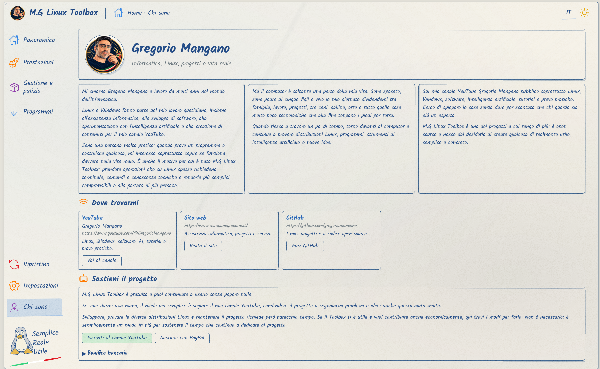

# M.G Linux Toolbox V2

English | [Italiano](README_IT.md)

Cross-distro Linux desktop utility for system information, performance, software management, gaming, cleanup and app installation.

## Screenshots

| Overview | Performance |
|---|---|
| [](docs/images/screenshots/panoramica.png) | [](docs/images/screenshots/prestazioni.png) |

## Features

- System information for the computer, storage, network and AI usage.
- Performance profiles and optional controls, shown only when the system supports them.
- Software sources, autostart management and cleanup tools.
- Gaming preparation, DNS management, WinBoat and GeForce NOW where supported.
- Gradia, Upscayl, Curtail, Ferdium and KDE Connect installation options.
- Flatpak, Snap and native packages where the selected feature and distribution support them.

## Supported Distributions

| Distribution | Distribution format |
|---|---|
| Ubuntu / Debian | Official `.deb` package |
| Fedora | Official AppImage |
| Arch Linux | Official AppImage |
| openSUSE | Official AppImage |

amd64 releases are provided. Individual features depend on the configured kernel, hardware, drivers and repositories.

## Installation

Download the appropriate package from the [latest stable release](https://github.com/gregoriomangano/mg-linux-toolbox/releases/latest). Ubuntu and Debian use the `.deb`; Fedora, Arch Linux and openSUSE use the AppImage.

For automatic installation:

```bash
curl -fsSL https://raw.githubusercontent.com/gregoriomangano/mg-linux-toolbox/main/install.sh | bash
```

The installer selects the suitable package, verifies its checksum and creates the required desktop integration.

## Updating

Run the same installer command again. It downloads the latest stable release, verifies the checksum and updates the installed package or AppImage together with its privileged components.

## License And Source Availability

M.G Linux Toolbox V2 is proprietary software distributed under the [M.G Linux Toolbox Proprietary License](LICENSE). This public repository contains distribution material and documentation only; it does not contain the V2 source code. Historical GPL releases remain subject to the terms that applied to those releases.

## Author And Website

Developed by **Gregorio Mangano**. Visit the [M.G Linux Toolbox website](https://www.manganogregorio.it/mg-linux-toolbox.html).

## Security

For security issues, see [SECURITY.md](SECURITY.md).
