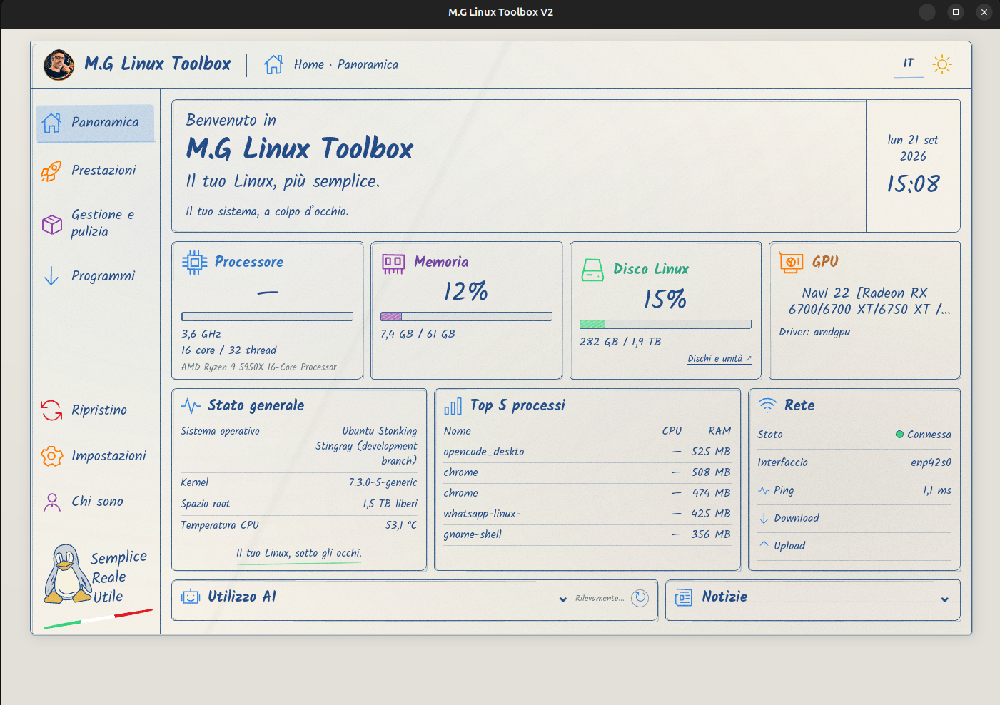
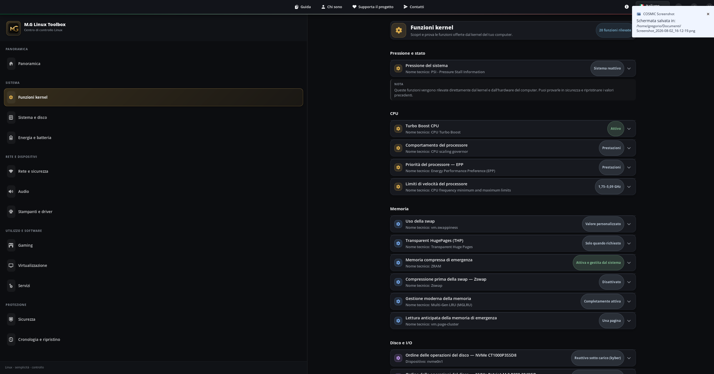
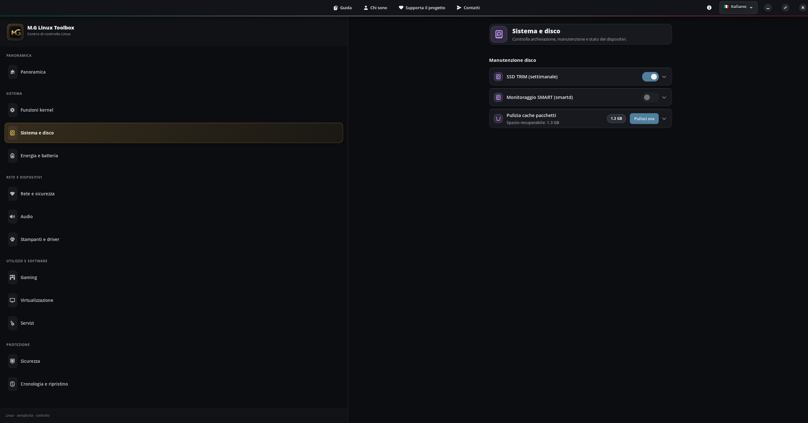
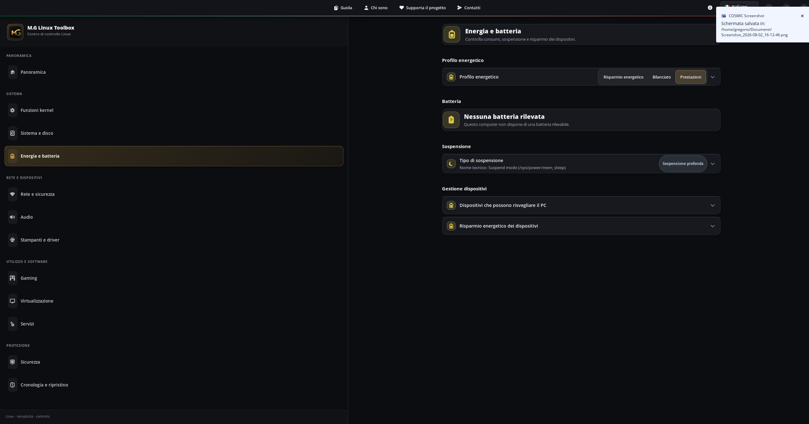
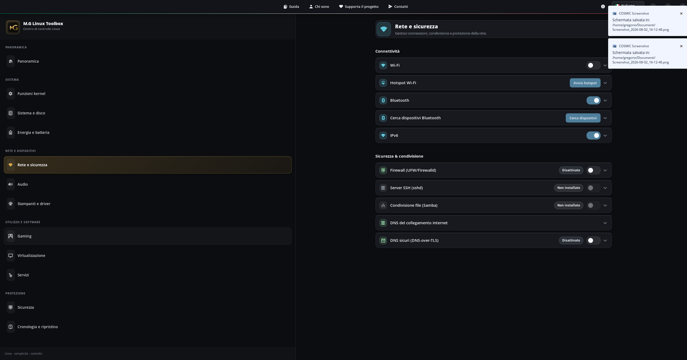
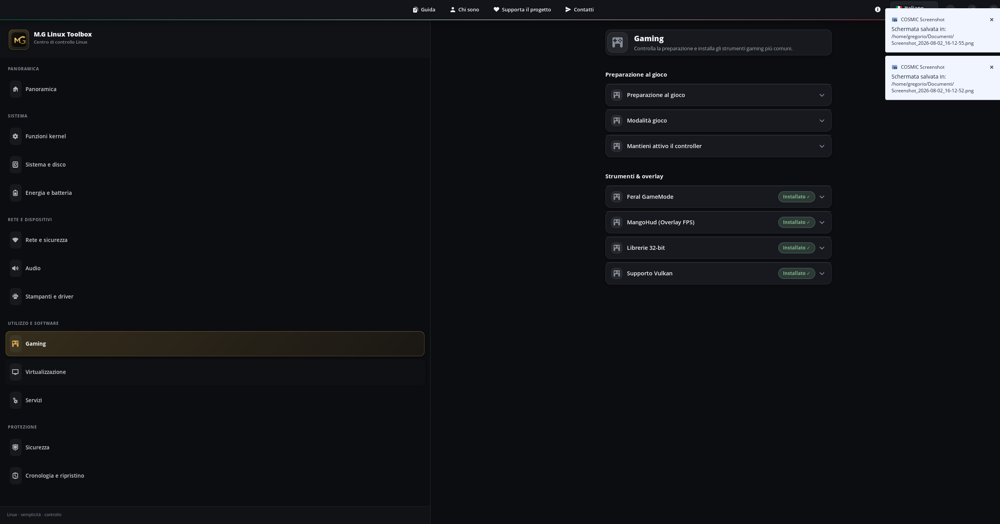
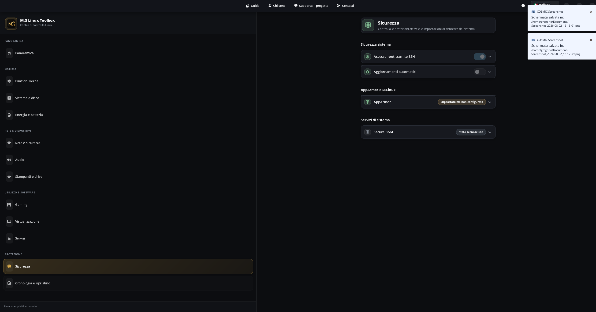
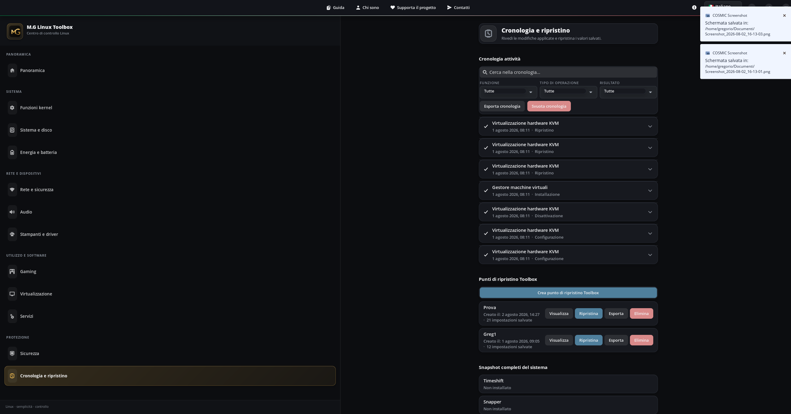

[Italiano](README.md) | [English](README_EN.md)

# M.G Linux Toolbox

M.G Linux Toolbox raccoglie in un'interfaccia grafica semplice funzioni Linux che normalmente richiederebbero il terminale.

## Stato del progetto

La versione **0.9.0 Beta 4** è la prerelease corrente. Il ramo locale per la prossima beta include il Gaming Pack installabile con controlli reali dei repository.

Il pacchetto AppImage verificato e il relativo checksum sono associati alla [Release v0.9.0-beta.4](https://github.com/gregoriomangano/mg-linux-toolbox/releases/tag/v0.9.0-beta.4).

Il codice è distribuito con licenza **GPL-3.0-or-later**. Nome, logo e identità del progetto sono trattati separatamente in [TRADEMARKS.md](TRADEMARKS.md).

## Screenshot principali

| Panoramica | Funzioni Kernel |
|---|---|
| [](docs/images/screenshots/panoramica.png) | [](docs/images/screenshots/funzioni-kernel.png) |
| Sistema e disco | Energia e batteria |
| [](docs/images/screenshots/sistema-disco.png) | [](docs/images/screenshots/energia-batteria.png) |
| Rete e sicurezza | Gaming |
| [](docs/images/screenshots/rete-sicurezza.png) | [](docs/images/screenshots/gaming.png) |
| Sicurezza | Cronologia e ripristino |
| [](docs/images/screenshots/sicurezza.png) | [](docs/images/screenshots/cronologia-ripristino.png) |

Tutte le schermate approvate sono raccolte nella [galleria completa](docs/SCREENSHOTS.md).

## Che cosa permette di fare

M.G Linux Toolbox rende più semplici funzioni e impostazioni Linux che normalmente richiederebbero il terminale.

Il programma rileva ciò che il kernel, l'hardware e il sistema supportano realmente, spiega ogni funzione con parole semplici e, quando possibile, permette di provarla temporaneamente prima di renderla permanente.

Una funzione può mostrare:

- il livello di rischio;
- che cos'è;
- il possibile vantaggio;
- quando è meglio evitarla;
- lo stato attuale;
- il valore iniziale;
- una prova valida fino al riavvio;
- una modifica permanente, quando supportata;
- il modo per ripristinare il valore precedente.

## Funzioni Kernel

Questa sezione mostra soltanto le funzioni rilevate sul computer in uso. Può includere gestione del processore, memoria, swap, ZRAM, Zswap, Transparent Huge Pages, scheduler dei dischi e altre capacità offerte dal kernel.

La disponibilità cambia in base a kernel, hardware, driver e distribuzione. Una voce non disponibile non viene presentata come utilizzabile.

## Aree del programma

- **Sistema e dischi:** informazioni sul sistema, dispositivi, TRIM, SMART, manutenzione controllata e attività live del disco basata su dati `/proc` e `/sys`.
- **Rete e sicurezza:** Wi-Fi, hotspot, Bluetooth, IPv6, firewall, DNS e servizi di condivisione disponibili.
- **Energia e batteria:** profili energetici, sospensione, batteria e risparmio dei dispositivi.
- **Audio:** stato di PipeWire, dispositivi, riavvio audio e opzioni di risparmio energetico.
- **Stampanti:** servizio CUPS, supporto di base e driver rilevati.
- **Software e repository:** stato di Flatpak e Flathub, sorgenti software rilevate e controlli sulla salute dei pacchetti, con comportamenti adattati alla distribuzione.
- **Gaming:** stato di GameMode, Vulkan, librerie e strumenti comunemente usati per giocare; il Gaming Pack controlla la disponibilità reale nei repository configurati e permette installazione e rimozione sicure dei soli pacchetti registrati dal Toolbox.
- **Virtualizzazione:** KVM, IOMMU, VFIO, KSM e motori per container.
- **Servizi:** stato, avvio, arresto e attivazione automatica dei servizi riconosciuti.
- **Sicurezza:** accesso SSH, aggiornamenti, AppArmor, SELinux e protezioni rilevate.
- **Cronologia e ripristino:** operazioni registrate, punti di ripristino e ritorno ai valori salvati.

## Prova fino al riavvio

Quando una funzione lo consente, puoi provarla senza renderla subito permanente. La modifica resta valida fino al riavvio: in questo modo puoi controllare stabilità, consumi e comportamento prima di decidere.

Una prova temporanea non garantisce un miglioramento. Se il risultato non è utile, riavvia oppure usa il ripristino indicato dal programma.

## Modifiche permanenti e ripristino

Le modifiche permanenti vengono proposte soltanto quando il sistema le supporta. Prima di confermare:

1. leggi rischio e casi in cui evitare la funzione;
2. annota o controlla il valore iniziale;
3. esegui prima una prova temporanea, se disponibile;
4. conserva un punto di ripristino;
5. verifica il risultato dopo un riavvio.

La cronologia aiuta a ricostruire le operazioni effettuate. Alcune modifiche di sistema richiedono privilegi amministrativi.

La Beta 4 rilegge il valore reale dopo ogni ripristino: un'operazione viene registrata come riuscita soltanto quando il valore corrisponde davvero a quello iniziale salvato per la prova corrente.

## Installazione

Il metodo automatico controlla le dipendenze, verifica il checksum, installa l'AppImage nella cartella personale e aggiunge nome e icona al menu delle applicazioni:

```bash
curl -fsSL https://raw.githubusercontent.com/gregoriomangano/mg-linux-toolbox/main/install.sh | bash
```

In alternativa, l'AppImage può essere scaricata dalla Release e avviata manualmente. Non usare vecchie AppImage o collegamenti non indicati nei canali ufficiali. L'AppImage usa Python 3, GTK4, Libadwaita, PyGObject e FUSE forniti dal sistema; l'installer ne controlla la presenza, incluse le versioni minime reali (**Libadwaita 1.4** è il vincolo effettivo — vedi la [guida di installazione](docs/INSTALLAZIONE.md#versioni-minime-reali-dalla-beta-4)).

Consulta la [guida di installazione](docs/INSTALLAZIONE.md) per i due metodi, le dipendenze e FUSE.

## Aggiornamento

Con l'installazione automatica, rieseguire lo stesso comando scarica la versione più recente disponibile per il canale scelto. Il checksum viene controllato prima di sostituire il file; la versione precedente viene conservata temporaneamente e rimane attiva se il controllo o l'aggiornamento falliscono.

## Disinstallazione

- Per una AppImage avviata manualmente, chiudi il programma e sposta nel cestino soltanto il file AppImage.
- Per l'installazione automatica usa `uninstall.sh`: rimuove AppImage, collegamento del menu, icona e backup della versione precedente.
- `uninstall.sh` conserva per impostazione predefinita cronologia, impostazioni e punti di ripristino. L'opzione `--purge` li elimina soltanto dopo una conferma esplicita.
- Python, GTK4, Libadwaita, PyGObject e FUSE non vengono rimossi perché possono servire ad altri programmi.

Disinstallazione normale dell'installazione automatica:

```bash
curl -fsSL https://raw.githubusercontent.com/gregoriomangano/mg-linux-toolbox/main/uninstall.sh | bash
```

I dati dell'utente si trovano normalmente in `~/.local/share/mg-linux-toolbox` e `~/.local/state/mg-linux-toolbox`, oppure nelle directory XDG equivalenti.

## Problemi comuni

La guida [Problemi comuni](docs/PROBLEMI_COMUNI.md) spiega cosa controllare quando:

- l'AppImage non parte;
- compare un errore FUSE;
- mancano GTK4, Libadwaita o PyGObject;
- una funzione non è disponibile;
- occorre raccogliere un errore senza condividere dati personali.

## Sicurezza e limiti

M.G Linux Toolbox non promette:

- prestazioni sempre migliori;
- più FPS garantiti;
- Internet sempre più veloce;
- compatibilità con ogni distribuzione;
- assenza assoluta di rischi.

Una scelta utile su un computer può essere inutile o controproducente su un altro. Leggi sempre le spiegazioni mostrate e concedi privilegi soltanto per un'azione riconosciuta.

Ambiente verificato durante la preparazione pubblica: **Pop!_OS 24.04 LTS**, Python 3.12, GTK 4.14, Libadwaita 1.5 e PyGObject 3.48. Il Gaming Pack è stato verificato nei container puliti Debian 13, Fedora 44, Arch Linux e openSUSE Tumbleweed; il controllo finale sui pacchetti resta comunque legato ai repository configurati sulla macchina dell'utente. Per altre distribuzioni moderne la compatibilità deve essere verificata. **Debian 12 non è dichiarata supportata: la sua Libadwaita 1.2.2 è sotto la versione minima reale richiesta (1.4)**, verificato empiricamente in un container Debian 12 — l'app lo rileva e lo dice chiaramente invece di fallire con un errore tecnico.

Per le segnalazioni riservate consulta [SECURITY.md](SECURITY.md). Per i limiti generali consulta [DISCLAIMER.md](DISCLAIMER.md).

## Supporto e donazione

- Contatti: <https://www.manganogregorio.it/contatti-gregorio-mangano-mondovi/>
- Donazione PayPal: <https://www.paypal.com/donate/?hosted_button_id=7LCEUTKBTB6HW>

Verifica sempre il destinatario prima di confermare un pagamento.

## Collegamenti ufficiali

- Sito: <https://www.manganogregorio.it/>
- Pagina del progetto: <https://www.manganogregorio.it/m-g-linux-toolbox/>
- Canale YouTube: <https://www.youtube.com/@GregorioMangano>
- Contatti: <https://www.manganogregorio.it/contatti-gregorio-mangano-mondovi/>
- Codice pubblico: <https://github.com/gregoriomangano/mg-linux-toolbox>
- Release: <https://github.com/gregoriomangano/mg-linux-toolbox/releases/tag/v0.9.0-beta.4>

## Autore

M.G Linux Toolbox è sviluppato da **Gregorio Mangano**.

## Licenza

Il codice è disponibile secondo la **GNU General Public License, versione 3 o successiva** (`GPL-3.0-or-later`). Il testo completo è in [LICENSE](LICENSE).

La GPL riguarda il codice e non rende automaticamente ufficiali le versioni modificate. Nome, logo, icona e identità del progetto sono descritti in [TRADEMARKS.md](TRADEMARKS.md).

## Compilare ed eseguire dal sorgente

Requisiti minimi:

- Python 3;
- PyGObject;
- GTK4;
- Libadwaita.

Avvio dal sorgente:

```bash
python3 main.py
```

Test automatici:

```bash
python3 -m unittest discover -s tests
```

La preparazione di una AppImage richiede inoltre `rsync`, `sha256sum` e una copia verificata di `appimagetool`. Il pacchetto della Release 0.9.0 Beta 4 viene costruito da un'AppDir nuova e verificato prima della pubblicazione.
