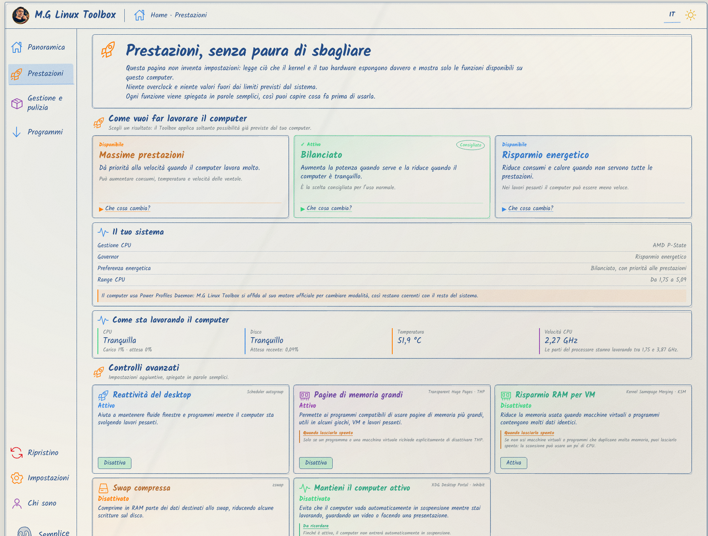

# M.G Linux Toolbox V2

M.G Linux Toolbox makes Linux functions and settings easier to use without requiring the terminal.

## Screenshots

| Overview | Performance |
|---|---|
| [](docs/images/screenshots/panoramica.png) | [](docs/images/screenshots/prestazioni.png) |

### About

[](docs/images/screenshots/chi-sono.png)

## What it does

- shows the computer, disks, network and AI usage clearly;
- manages Performance profiles and controls;
- manages software sources, autostart and cleanup;
- installs Gaming components, DNS, WinBoat and GeForce NOW when supported;
- installs Upscayl, Gradia, Ferdium and Curtail;
- restores changes and manages settings.

Features are shown according to what the system actually supports.

## Installation

### Ubuntu and Debian

Download the `.deb` package from [Release v1.0.0](https://github.com/gregoriomangano/mg-linux-toolbox/releases/tag/v1.0.0) and install it with the distribution software manager.

### Automatic installation

```bash
curl -fsSL https://raw.githubusercontent.com/gregoriomangano/mg-linux-toolbox/main/install.sh | bash
```

Ubuntu and Debian use the official `.deb`. Fedora, Arch and openSUSE use the official AppImage; the installer also installs required components and creates a menu entry.

## Compatibility

amd64 releases are provided for modern Debian/Ubuntu, Fedora, Arch and openSUSE based distributions. Individual features depend on the configured kernel, hardware, drivers and repositories.

## Updating

For automatic installations, run the same command again. The installer downloads the latest stable release, verifies its checksum before installation and updates privileged components too.

## Author

M.G Linux Toolbox V2 is developed by **Gregorio Mangano**.

## License

M.G Linux Toolbox V2 is distributed under the [M.G Linux Toolbox Proprietary License](LICENSE). The V2 source code is not public. Historical versions released under the GPL remain subject to the GPL terms that applied to those releases.

For security issues, see [SECURITY.md](SECURITY.md).
