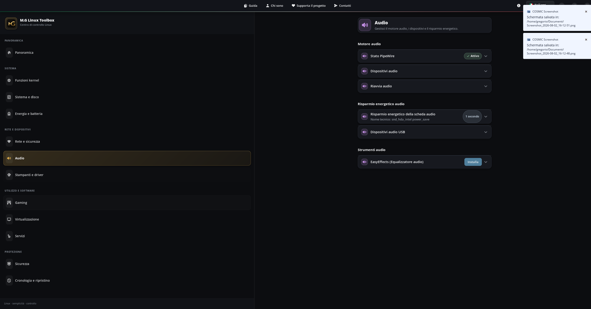
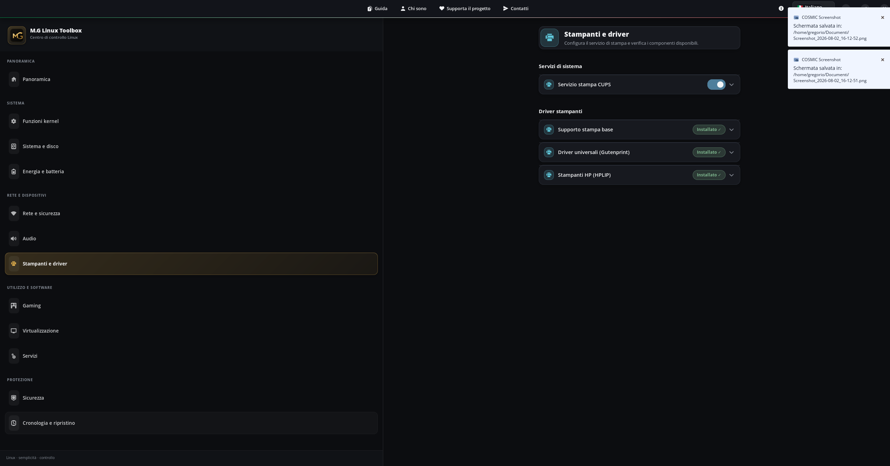
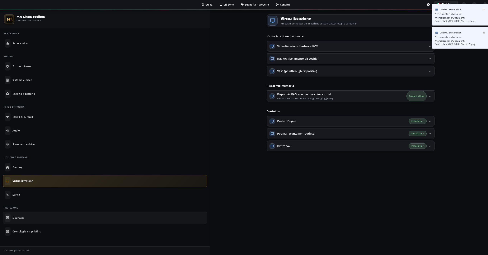
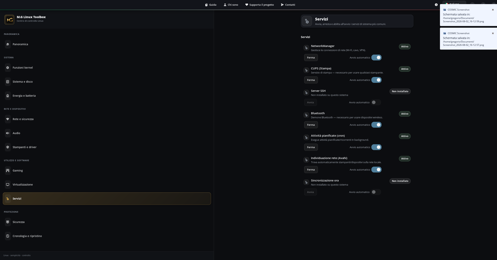

# Galleria di M.G Linux Toolbox

Questa pagina raccoglie le schermate approvate del programma. Fai clic su un'immagine per aprirla nelle dimensioni originali.

## Panoramica

Mostra lo stato generale del sistema, le risorse, le funzioni Kernel rilevate e i dischi.

## Funzioni Kernel

Raccoglie le capacità realmente offerte dal kernel e dall'hardware del computer.

## Sistema e disco

Mostra manutenzione dei dischi, TRIM, SMART e pulizia controllata della cache dei pacchetti.

## Energia e batteria

Raccoglie profilo energetico, batteria, sospensione e risparmio dei dispositivi.

## Rete e dispositivi

Mostra connettività, Bluetooth, condivisione file e impostazioni DNS rilevate. Firewall e SSH sono ora nella pagina Sicurezza.

## Audio

Mostra lo stato del motore audio, i dispositivi e le funzioni di risparmio energetico.

## Stampanti e driver

Mostra il servizio di stampa e i componenti disponibili.

## Gaming

Raccoglie lo stato degli strumenti e delle librerie comunemente usati per giocare.

## Virtualizzazione

Mostra KVM, IOMMU, VFIO, KSM e motori per container.

## Servizi

Mostra lo stato e l'avvio automatico dei servizi riconosciuti.

## Sicurezza

Raccoglie firewall, accesso SSH, aggiornamenti automatici, AppArmor/SELinux, Secure Boot e l'antivirus ClamAV (installazione, aggiornamento firme e scansione file/cartelle).

## Cronologia e ripristino

Mostra attività registrate, punti di ripristino Toolbox e strumenti di snapshot disponibili.
